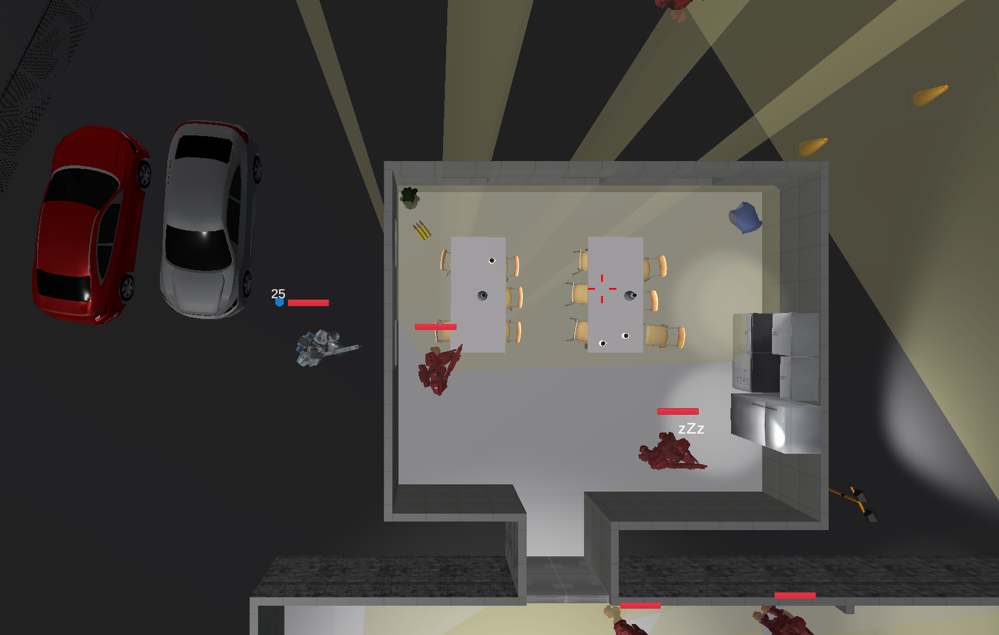

# 1DV437-MyGame
A top-down shooter game made in unity.

# Documents
[Assignment instructions](documentation/Project-Specification.pdf)

[Initial Game Description](documentation/1DV437-Assignment_1-Game-Description.pdf)

[Technical Report](documentation/1DV437-Assignment_3-Technical-Details-Report.pdf)

# Requirements to run
Computer w. keyboard & mouse
(Unity for non pc users)

# How to run
For windows or linux 64 bit (the linux build is slightly older), you can download the compiled game from https://github.com/Bumpfel/1DV437-TopDownShooter-Compiled

For other OS's, open in [unity](https://unity.com/) and compile to operating system of choice.
